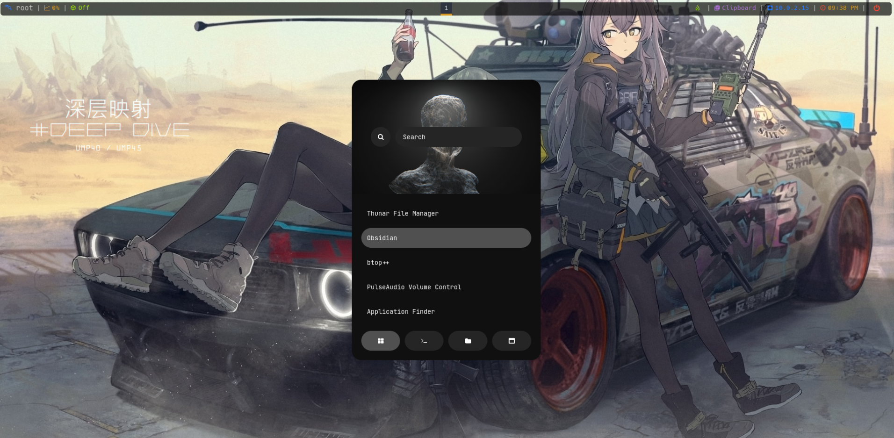
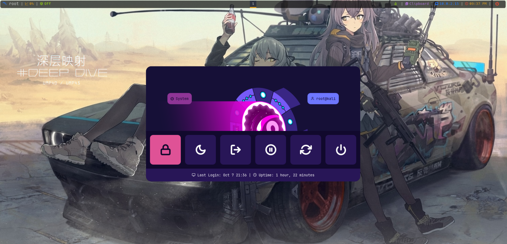
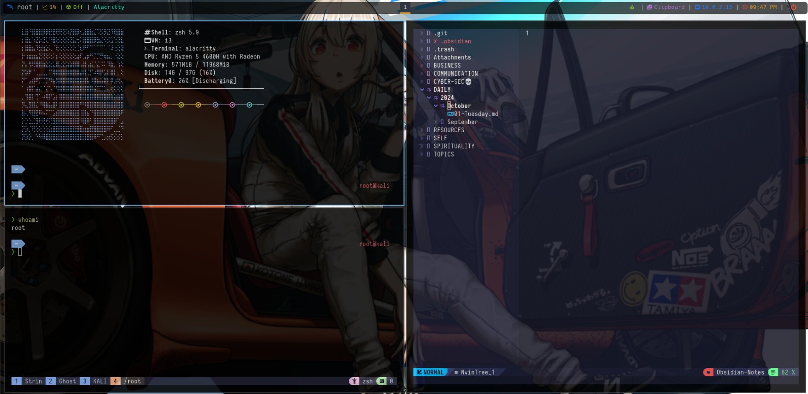
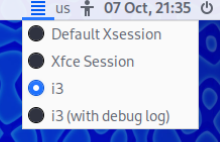

## `🐲` KaliGhost

>[!Important]
>**This is meant to be installed on a _fresh_ Kali install**. You _could_ do this on your battle-hardened Kali machine with all your previous configurations, but make sure you alter the script to preserve your previous configs or back them up first. 

<table>
    <tr>
        <td><b>OS</b></td>
        <td>Kali Linux</td>
    </tr>
    <tr>
        <td><b>Window Manager</b></td>
        <td>i3</td>
    </tr>
    <tr>
        <td><b>Terminal</b></td>
        <td>Alacritty</td>
    </tr>
    <tr>
        <td><b>Shell</b></td>
        <td>Zsh + Oh My Zsh</td>
    </tr>
    <tr>
        <td><b>IDE</b></td>
        <td>NeoVim</td>
    </tr>
    <tr>
        <td><b>Font</b></td>
        <td>JetBrains Mono Nerd</td>
    <tr>
        <td><b>File Manager</b></td>
        <td>Dolphin</td>
    </tr>
    <tr>
        <td><b>Launcher</b></td>
        <td>Rofi</td>
    </tr>
    <tr>
        <td><b>StatusBar</b></td>
        <td>Polybar</td>
    </tr>
    <tr>
        <td><b>Compositor</b></td>
        <td>Picom</td>
    </tr>
</table>

## `📸` Screenshots





## `💾` Installation
Clone the repo `git clone https://github.com/StrinGhost/KaliGhost.git && cd KaliGhost`

Simply `chmod +x install.sh` the installation script if it isn't already marked as executable and then just run it with `sudo ./install.sh`. 

#### One Command Setup for Lazy Sloths🦥
```bash
git clone https://github.com/StrinGhost/KaliGhost.git && cd KaliGhost && sudo ./install.sh
```

After successfully installing everything, make sure you reboot your system.
Once you reboot and you're in the login menu, you will have to select `i3` from the drop-down list and just log in.




## `⌨️` KeyBindings

Feel free to modfiy any configuration as you like these configurations suites me best. If you feel I should update or add something don't hesitate opeening an issue or pull request I will try to respond as quick as possible.

<table>
    <tr>
        <td><b>i3</b></td>
        <td><a href=config/i3>ReadMe</a></td>
    </tr>
    <tr>
        <td><b>PolyBar</b></td>
        <td><a href=config/polybar>ReadMe</a></td>
    </tr>
    <tr>
        <td><b>Tmux</b></td>
        <td><a href=config/tmux>ReadMe</a></td>
    </tr>
    <tr>
        <td><b>Alacritty</b></td>
        <td><a href=config/alacritty>ReadMe</a></td>
    </tr>
    <tr>
        <td><b>Rofi</b></td>
        <td><a href=config/rofi>ReadMe</a></td>
    </tr>
    <tr>
        <td><b>NeoFetch</b></td>
        <td><a href=config/neofetch>ReadMe</a></td>
    </tr>
</table>

## `❓` Why
I created it to simplify the process of setting up a customized Kali Linux environment. As a pentester, I've often found myself spending hours configuring and installing various tools and configurations from scratch. This script aims to automate that process, making it easy for users to get started with a fully functional and customized Kali Linux environment.

